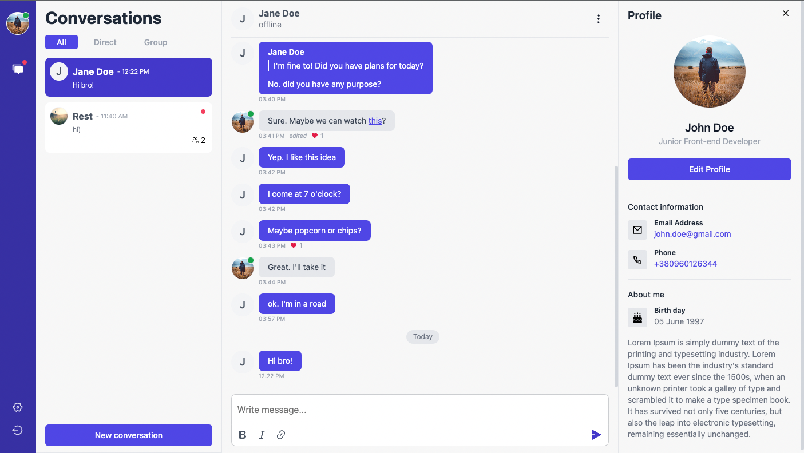

# Realtime Chat
Welcome to React chat app! The application allows users to create accounts, log in, create direct or group conversations. 
Users can send and receive real-time messages and see when other users is online or offline. 

## Features
The Chat App includes the following features:

1. User authentication: User can register or log in using email and password.
2. User settings: User can change his personal data in the settings menu.
3. Direct and group conversations: User can create direct conversation with another user. Also, the user can create a group chat to which he can invite as many users as he wants. A group administrator can change group settings.
4. Real-time messaging: User can send messages that will arrive to interlocutors in real time.
5. Message management: User can edit messages, delete and mark favorite messages.
6. Reply to message: User can reply to the interlocutor's message by attaching his message to his message so as not to lose the context of the conversation.
7. New message indicator: User receives a visual notification of new messages.
8. Online users indicator: Users who are currently online receive a corresponding indicator.
9. Сonversation filter: The user can sort conversations by their type.
10. Responsive: Responsive design with Tailwind.

## Setup project

1. Clone the repository from GitHub `$ git clone https://github.com/NPavliuk/react-realtime-chat.git`
2. Install the dependencies using `npm install`.
3. Run the app using `npm run start`.
4. Navigate to http://localhost:3000 in your browser.

## Technologies

* React 18.2.0
* Redux 4.2.0
* React Router DOM 6.8.0
* Redux Saga 1.2.2
* Tailwind CSS 3.2.4
* Firebase 9.16.0
